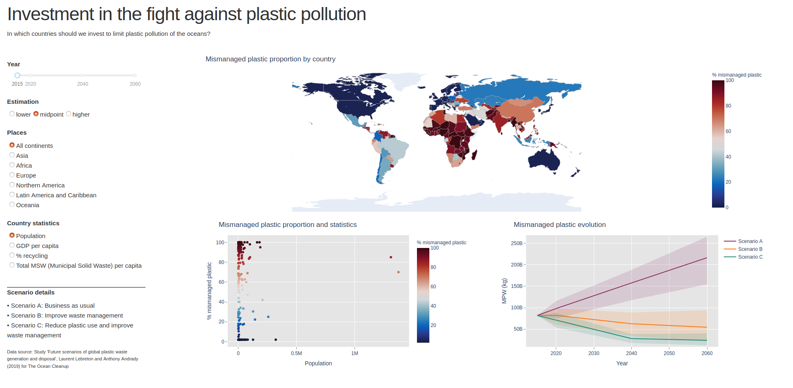

# Telecom Paris - Data Visualization project

Repository of the **group D**.

## Presentation
We built a dashboard to answer the question *Where to invest for a better plastic waste management?*

The data comes from the study *[Future scenarios of global plastic waste generation and disposal](https://www.nature.com/articles/s41599-018-0212-7)*, Laurent Lebreton and Anthony Andrady (2019) for The Ocean Cleanup,

## Implementation

The dashboard is implemented with Dash / Plotly.

There are two files containing the app:
* `app.py`: runs the app, builds the layout, manages the interactions;
* `compute_graph.py`: builds the three graphics.

The notebook `igr204-exploration.ipynb` was used as a draft to build the graphics.

## Result

The poster presenting the dashboard and our approach is in the *Poster/* folder.

